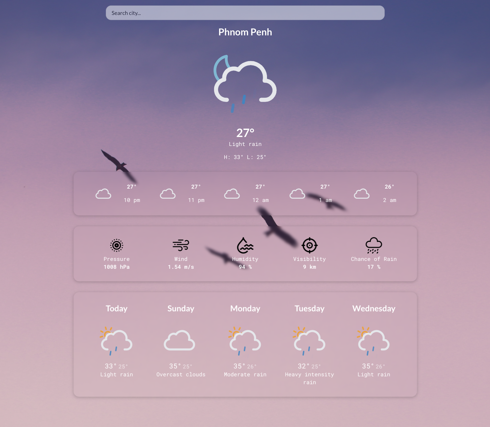

       

# Weather K: Your Personal Weather Informant

## Table of Contents
1. [Introduction](#weather-k-your-personal-weather-informant)
2. [Features](#features)
3. [Development Stack](#development-stack)
    - [Key Projects Element](#key-projects-element)
    - [External Library](#external-library)
5. [Reflection](#reflection)
6. [Installation](#installation)
7. [Convention Guide](#convention-guide)
8. [UI Prototype](#ui-prototype)
9. [Reference/Resource](#reference/resource)
10. [App Overview](#app-overview)

## Introduction

Weather is more than just a topic of small talk. It influences our daily decisions, from the outfits we choose to the activities we plan. **Weather K** understands the importance of accurate weather information, and brings it to your fingertips in a streamlined and user-friendly interface. Whether you're planning a trek, a picnic, or simply deciding on an umbrella, with **Weather K**, you're always a step ahead of the sky.

## Features

- **Current Weather**: Offers real-time weather data including temperature, main weather conditions, and descriptive summaries.
- **Hourly Forecast**: Stay prepared for the next five hours with pinpoint hourly predictions.
- **5-Day Forecast**: Plan your week better with daily weather forecasts, ensuring no surprises.
- **GeoLocation**: Auto-detects user's current location for instant weather insights.
- **City Search**: Curious about the weather elsewhere? Search for any city's weather conditions.
- **Responsive Interface**: Whether on a mobile, tablet, or desktop, experience seamless responsiveness.

## Development Stack
### Key Projects Element

- **React**: Utilized for a modular and maintainable frontend.
- **State Management:** [Redux Toolkit](https://redux-toolkit.js.org/) keeps data organized.
- **Data Retrieval:** Data retrieval relies on [Axios](https://axios-http.com/docs/intro) for robust HTTP requests.
- **Location Detection:** [Geolocation API](https://developer.mozilla.org/en-US/docs/Web/API/Geolocation_API) identifies user locations.
- **Data Source:** [OpenWeather API](https://openweathermap.org/api) provides accurate weather information.
- **Weather Icons:** Animated icons from [Mateocons](https://bas.dev/work/meteocons) for visual weather representation.
- **Cities data**: Python is used to perform data cleaning on city data from OpenWeather.

### External Library
- **sass:** Used for nested styling to improve code organization and readability.
- **eslint-plugin-react:** Enforces coding standards, including the use of semicolons, to maintain code consistency and quality.
- **react-spinners:** Provides loading icons to visually indicate data fetching processes and keep users informed.
- **axios:** Utilized for making HTTP GET requests to the OpenWeather API endpoint, enabling data retrieval.
- **react-redux && redux-toolkit:** Empowers efficient data management, including data retrieval and asynchronous actions, enhancing the state management in the application.
- **semantic-ui-react:** Enhances the user interface with a feature-rich search bar component for an improved user experience.
- **lodash:** Use lodash debounce function to prevent a function from being called too many times in quick succession

## Reflection
#### During the process of developing this web application, I gained valuable insights and knowledge in several key areas:

- **State Management:** Learn how to effectively utilize Redux for maintaining the application's state and became proficient in handling asynchronous operations using Async Thunk.

- **API Request Structuring:** Structure API requests effectively, using Axios in conjunction with Async thunk.

- **Data Display:** Became adept at extracting and presenting data obtained from API responses on the user interface

- **User Location Detection:** Implement the built-in Geolocation module to automatically detect user's current location, enhancing the accuracy of weather information provided.

- **Timestamp Conversion:** Develop the capability to convert Unix timestamps into human-readable time formats.

- **API Documentation Importance:** Recognize the significance of thorough API documentation, which played a pivotal role in efficiently integrating external data sources into the application.

- **Error Handling:** Address potential issues that might arise during data retrieval and processing.

- **Data Cleaning:** Leverage Python Pandas library, to clean and prepare JSON data sourced from Openweather for use within the application.

#### Based on the feedback from the previous project, I've made the following key improvements:

- **Modular API Requests:** Organize different API requests into separate files or modules, creating Redux slices for each specific API endpoint. This modular approach improves code organization and maintainability.

- **ESLint Rule:** Add an ESLint rule to enforce the use of semicolons throughout the codebase. This ensures code consistency and maintains code quality.

- **Separate URI Management:** Manage URI separately to enhance code maintainability and flexibility.

- **Avoiding Hard-Coding:** Adopt the practice of avoiding hard-coding by creating variables or constants.

## Installation

1. Clone the project repository and switch to the cloned directory

```jsx
git clone https://github.com/anb-hq/CnD_Mok_Kimsang_Weather.git
cd CnD_Mok_Kimsang_Weather
```

2. Install all necessary dependencies for the project

```jsx
npm install
```

3. Start the development server

```jsx
npm run dev
```

💡 After launching the development server, **Weather K** should be accessible in your preferred web browser. By default, the application will run on `http://localhost:5173/` . Ensure no other processes are occupying this port before initiating the server.

## Convention Guide

Link to the convention guide: [Convention Guide](https://www.notion.so/Convention-Guide-6a926126e0ad403186601689c0f6e524?pvs=21)

## UI Prototype

Link to the UI prototype: [Prototype](https://www.figma.com/file/w5W8OQVDbUpQJmOKKY1tcT/Untitled?type=design&node-id=0%3A1&mode=design&t=ahjlczJf1y55Hqfe-1)

## Reference/Resource

This project is a result of rigorous self-learning and research. The resources include:

1. React & Redux Toolkit: [Modern React with Redux—Stephen Grider](https://www.udemy.com/course/react-redux/)
2. Structuring API Requests: [The Complete 2023 Web Development Bootcamp—Angela Yu](https://www.udemy.com/course/the-complete-web-development-bootcamp/)
3. OpenWeather API Integration, Python Data Cleaning, Redux Toolkit, ESLint: Numerous online forums, Google, YouTube, and Documentation.

## App Overview:




